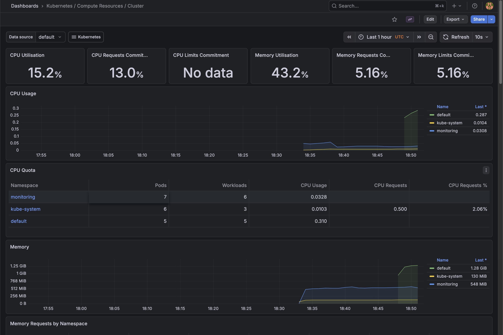
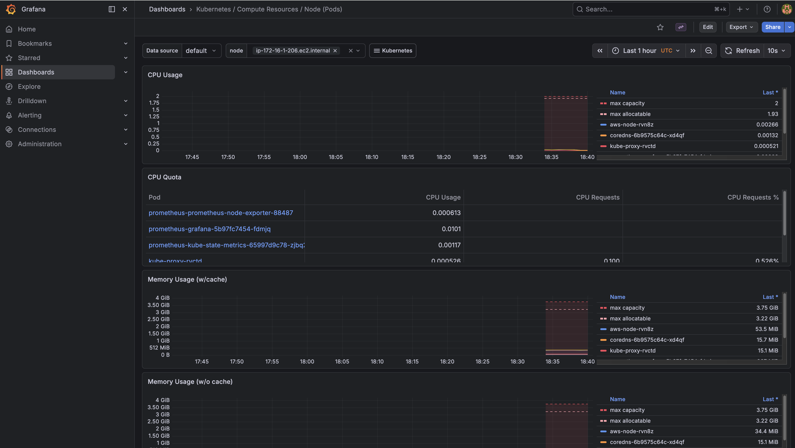
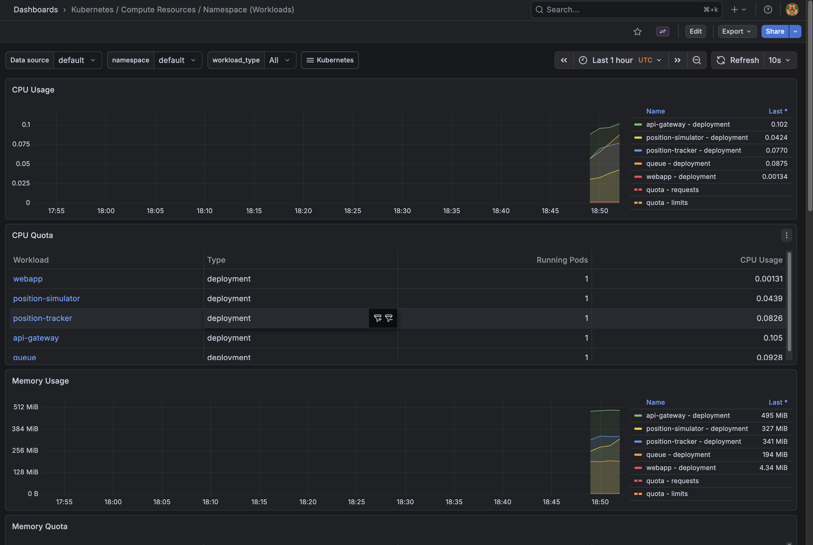
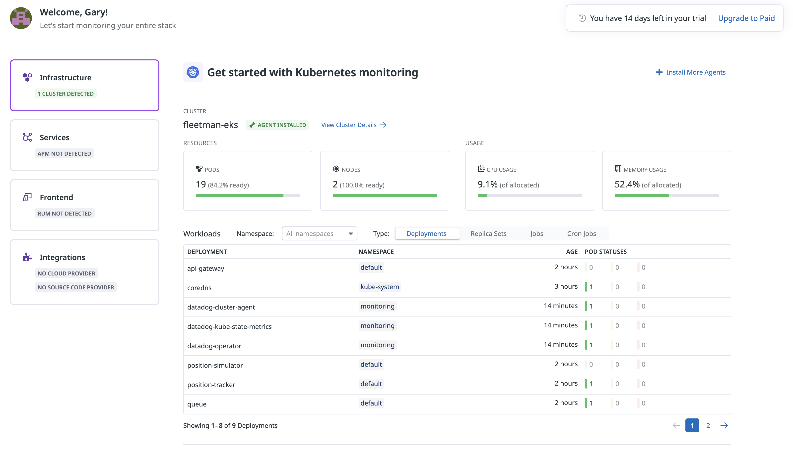
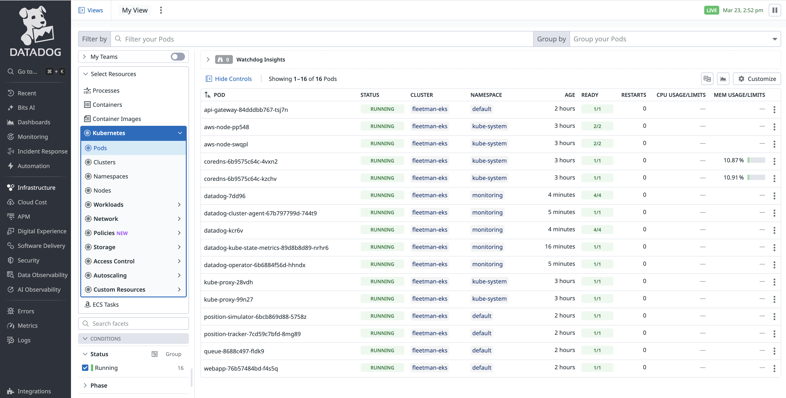
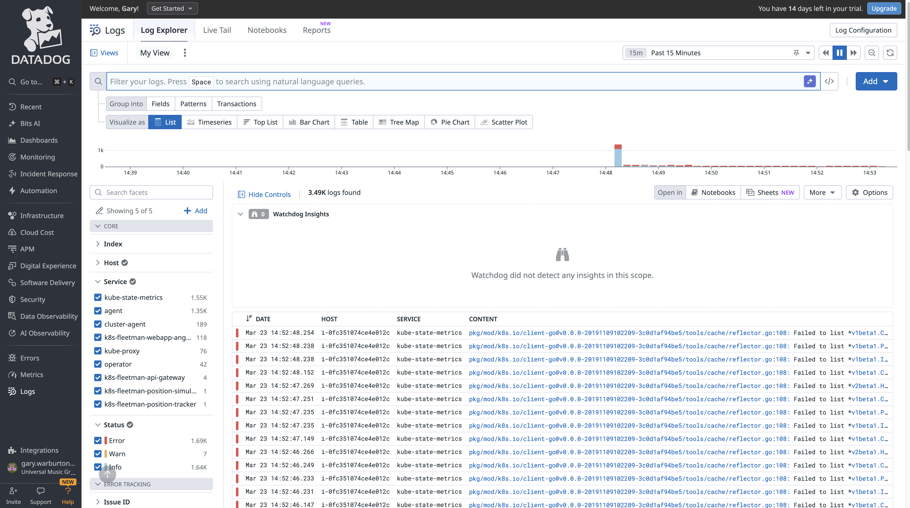

# Fleetman EKS Pipeline

A production-pattern Kubernetes deployment pipeline on AWS EKS, built to demonstrate real-world Infrastructure as Code, CI/CD automation, and cloud-native deployment practices.

## Overview

This project deploys the [Fleetman](https://github.com/richardchesterwood/k8s-fleetman) microservices application onto an AWS EKS cluster using GitHub Actions with OIDC authentication. No long-lived AWS credentials are stored anywhere.

## Architecture

- **VPC** — Custom VPC with public and private subnets across 3 availability zones
- **EKS** — Managed Kubernetes cluster (v1.32) with managed node groups
- **IAM** — OIDC-based trust between GitHub Actions and AWS (no stored credentials)
- **CI/CD** — Three GitHub Actions workflows covering the full deployment lifecycle

## Tech Stack

| Layer | Technology |
|-------|-----------|
| Cloud | AWS (EKS, VPC, IAM, ELB) |
| Infrastructure as Code | Terraform ~> 1.0 |
| Container Orchestration | Kubernetes 1.32 |
| CI/CD | GitHub Actions |
| Authentication | OIDC (keyless AWS auth) |

## Workflows

| Workflow | Trigger | Description |
|----------|---------|-------------|
| Smoke Test | Manual | Verifies cluster connectivity and node health |
| Deploy | Manual | Deploys all Fleetman microservices to EKS |
| Destroy | Manual | Tears down all Kubernetes resources |

## Project Structure
```
fleetman-eks/
├── terraform/          # EKS cluster, VPC, IAM, OIDC
├── k8s/                # Kubernetes manifests
│   ├── services.yaml
│   └── workloads.yaml
└── .github/
    └── workflows/      # CI/CD pipeline definitions
```

## Prerequisites

- AWS CLI configured with appropriate profile
- Terraform >= 1.0
- kubectl
- GitHub repository with `AWS_ROLE_ARN` secret configured

## Usage

### Provision Infrastructure
```bash
cd terraform
terraform init
terraform apply
```

> Note: Set your AWS profile in `versions.tf` or export `AWS_PROFILE` before running.

### Deploy Application

Trigger the **Deploy Fleet to EKS** workflow manually from the GitHub Actions tab.

### Tear Down Application

Trigger the **Destroy Fleetman on EKS** workflow manually from the GitHub Actions tab.

### Destroy Infrastructure
```bash
cd terraform
terraform destroy
```

## Observability

The cluster includes a full observability stack deployed via Helm, consisting of Prometheus for metrics collection and Grafana for visualization.

### Cluster Overview


### Node Metrics


### Application Workloads


## Datadog Integration

In addition to the open-source Prometheus/Grafana stack, the cluster includes the Datadog Agent deployed via Helm, providing commercial-grade observability including infrastructure metrics, log aggregation, APM, and process monitoring.

### Cluster & Node Overview


### Pod Health Across All Namespaces


### Real-Time Log Aggregation


## Key Design Decisions

**OIDC Authentication** — GitHub Actions assumes an IAM role via OpenID Connect rather than using stored access keys. This is the current AWS best practice for CI/CD authentication.

**Private Node Groups** — EKS worker nodes live in private subnets with outbound internet access via NAT Gateway. Only the load balancer is publicly accessible.

**EKS Access Entries** — Cluster access is managed via the modern EKS access entry API rather than the legacy `aws-auth` ConfigMap.

**Single NAT Gateway** — Cost optimization for non-production use. A production deployment would use one NAT Gateway per availability zone for redundancy.

**Dual Observability Stack** — Both open-source (Prometheus/Grafana) and 
commercial (Datadog) observability tools are deployed, demonstrating 
familiarity with both approaches. Datadog is configured for the US5 region 
with log collection, APM, process monitoring, and network performance 
monitoring enabled.